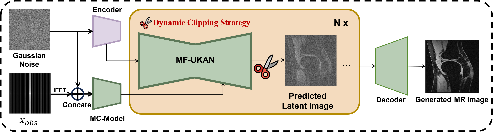

# TC-KANRecon

Overall structure of the TC-KANRecon:


Dynamic Clipping Strategy Process:



Model Generate Detailed Effect Comparison(AF=4):


## 1. Installation

Clone this repository and navigate to it in your terminal. Then run:

```
pip install -r requirements .
```

## 2. Data Preparation

The two datasets we used are both public datasets. For firstMRI, you can find it in [Link](https://fastmri.med.nyu.edu/), which includes 1172 subjects with more than 41,020 slice data; for SKM-TEA, you can find it in [Link](https://stanfordaimi.azurewebsites.net/datasets/4aaeafb9-c6e6-4e3c-9188-3aaaf0e0a9e7), which includes 155 subjects with more than 24,800 slice data. Both of them use the single-coil data of their knee.

When you have your data set ready, you need to change your data set path in the configuration file below:

- for vae:
```
python config/vae/config_monaivae_zheer.py
```
- for model:
```
python config/diffusion/config_controlnet.py
```

## 3. Training
- for vae:

```
python my_vqvae/train_vae.py

```
- for model:

```
python stable_diffusion/train_sd.py
python stable_diffusion/trian_model.py

```

## 4. Evaluating

```
python stable_diffusion/val_model.py

```

## 5. Citation
```
@article{ge2024tc,
  title={TC-KANRecon: High-Quality and Accelerated MRI Reconstruction via Adaptive KAN Mechanisms and Intelligent Feature Scaling},
  author={Ge, Ruiquan and Yu, Xiao and Chen, Yifei and Jia, Fan and Zhu, Shenghao and Zhou, Guanyu and Huang, Yiyu and Zhang, Chenyan and Zeng, Dong and Wang, Changmiao and others},
  journal={arXiv preprint arXiv:2408.05705},
  year={2024}
}
```
